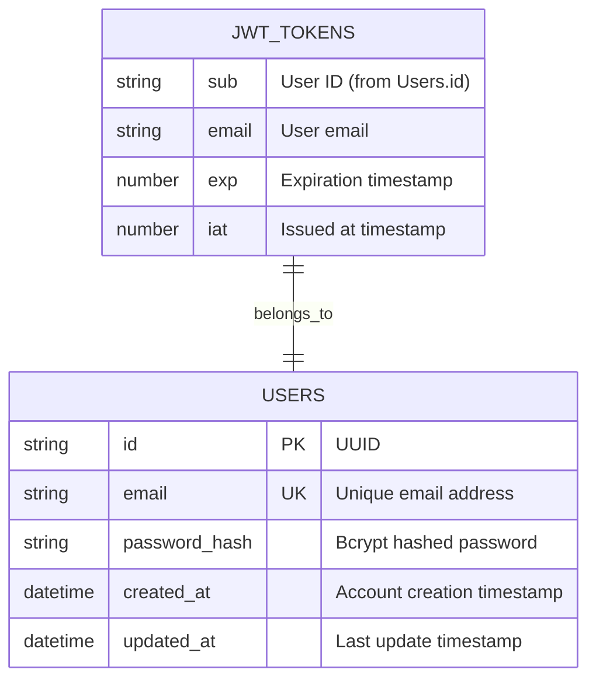
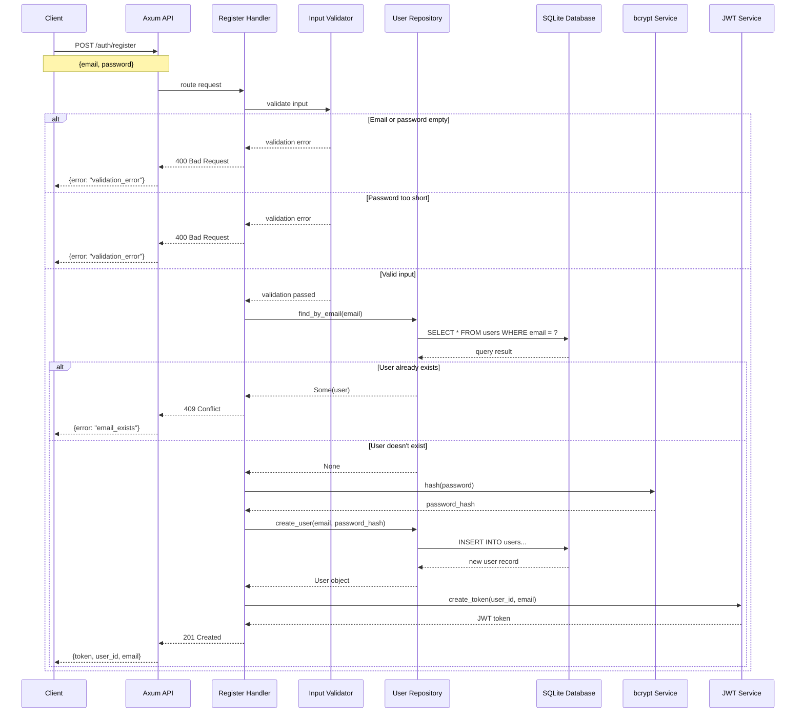
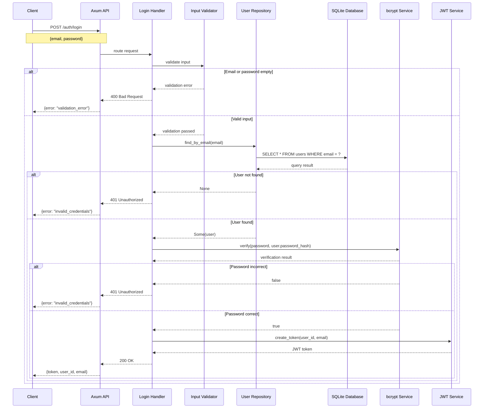
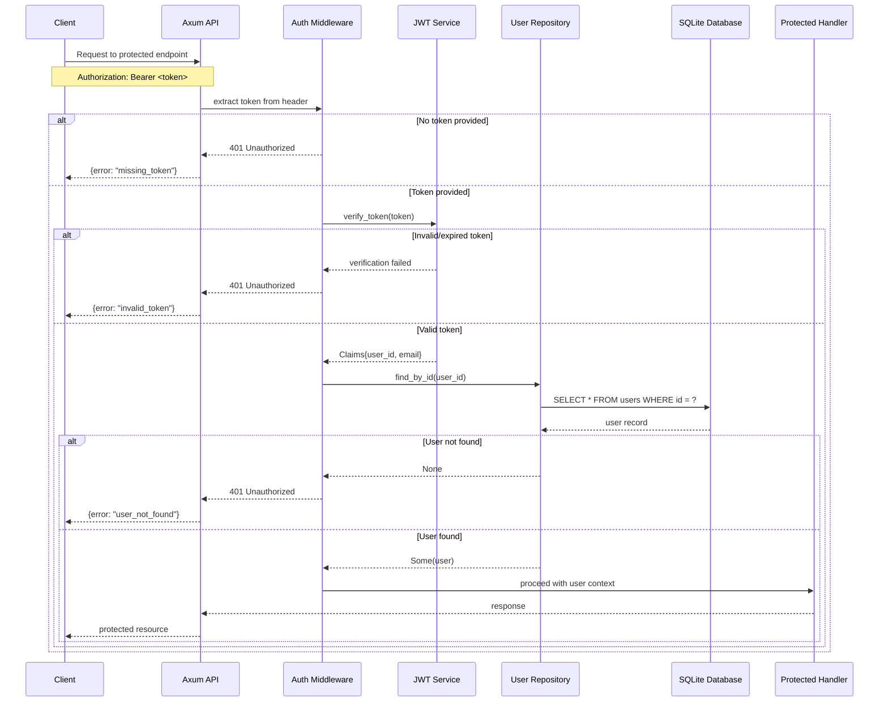

# Authentication API - System Documentation

## Overview
This document provides detailed system architecture documentation for the Authentication API built with Rust/Axum framework. The system provides user registration and login functionality with JWT token-based authentication.

## System Architecture

### Technology Stack
- **Backend Framework**: Axum (Rust)
- **Database**: SQLite
- **Authentication**: JWT (JSON Web Tokens)
- **Password Hashing**: bcrypt
- **Documentation**: OpenAPI/Swagger

---

## Entity Relationship Diagram



### Entity Descriptions

#### Users Table
- **id**: Primary key using UUID format
- **email**: Unique email address for user identification
- **password_hash**: Securely hashed password using bcrypt
- **created_at**: Timestamp when the account was created
- **updated_at**: Timestamp when the account was last modified

#### JWT Tokens (Virtual Entity)
- **sub**: Subject field containing the user ID
- **email**: User's email address embedded in token
- **exp**: Token expiration time (Unix timestamp)
- **iat**: Token issued at time (Unix timestamp)

---

## Sequence Diagrams

### User Registration Flow



### User Login Flow



### JWT Token Verification Flow (for protected routes)



---

## API Endpoints

### Authentication Endpoints

| Method | Endpoint | Description | Request Body | Response |
|--------|----------|-------------|--------------|----------|
| POST | `/auth/register` | Register new user | `RegisterRequest` | `AuthResponse` |
| POST | `/auth/login` | Login user | `LoginRequest` | `AuthResponse` |

### Utility Endpoints

| Method | Endpoint | Description | Response |
|--------|----------|-------------|----------|
| GET | `/` | Health check | System info JSON |
| GET | `/api-docs/openapi.json` | OpenAPI spec | OpenAPI JSON |
| GET | `/swagger-ui` | Swagger UI | HTML page |

---

## Data Models

### Request Models

```rust
// Registration request
{
  "email": "user@example.com",
  "password": "securepassword123"
}

// Login request
{
  "email": "user@example.com", 
  "password": "securepassword123"
}
```

### Response Models

```rust
// Successful authentication response
{
  "token": "eyJhbGciOiJIUzI1NiIsInR5cCI6IkpXVCJ9...",
  "user_id": "550e8400-e29b-41d4-a716-446655440000",
  "email": "user@example.com"
}

// Error response
{
  "error": "validation_error",
  "message": "Email and password are required"
}
```

---

## Security Features

### Password Security
- **Hashing Algorithm**: bcrypt with default cost (12)
- **Minimum Length**: 6 characters
- **Storage**: Only hashed passwords stored, never plain text

### JWT Security
- **Algorithm**: HS256 (HMAC with SHA-256)
- **Claims**: User ID, email, expiration, issued at
- **Secret Key**: Configurable (should be environment variable in production)

### Input Validation
- **Email Format**: Basic email validation
- **Password Requirements**: Minimum 6 characters
- **Sanitization**: Input trimming and validation

### Database Security
- **Unique Constraints**: Email addresses must be unique
- **Parameterized Queries**: Protection against SQL injection
- **Connection Pooling**: Managed SQLite connections

---

## Error Handling

### HTTP Status Codes

| Status Code | Description | Example Scenarios |
|-------------|-------------|-------------------|
| 200 | OK | Successful login |
| 201 | Created | Successful registration |
| 400 | Bad Request | Invalid input data |
| 401 | Unauthorized | Invalid credentials, expired token |
| 409 | Conflict | Email already exists |
| 500 | Internal Server Error | Database errors, hashing failures |

### Error Types

| Error Code | Description | HTTP Status |
|------------|-------------|-------------|
| `validation_error` | Input validation failed | 400 |
| `email_exists` | Email already registered | 409 |
| `invalid_credentials` | Wrong email or password | 401 |
| `database_error` | Database operation failed | 500 |
| `hash_error` | Password hashing failed | 500 |
| `token_error` | JWT generation/verification failed | 500 |

---

## Development Notes

### Testing Coverage
- Unit tests for all handlers
- Repository layer tests
- JWT service tests
- Integration tests for complete flows

### Performance Considerations
- Connection pooling for database
- Async/await for non-blocking operations
- Efficient password hashing with bcrypt

### Production Readiness
- Environment-based configuration needed
- Logging and monitoring to be added
- Rate limiting for authentication endpoints
- HTTPS enforcement
- Database migration system
